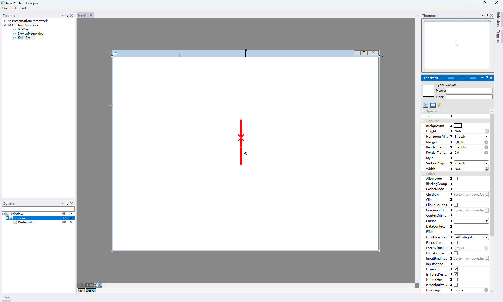

# OneLineDiagramDesigner

<!-- @import "[TOC]" {cmd="toc" depthFrom=1 depthTo=6 orderedList=false} -->

<!-- code_chunk_output -->

- [OneLineDiagramDesigner](#onelinediagramdesigner)
  - [Features](#features)
    - [Diagram Manage](#diagram-manage)
    - [Symbols](#symbols)
    - [DataBinding](#databinding)
  - [Pictures](#pictures)

<!-- /code_chunk_output -->
## Features

### Diagram Manage
- new diagram
- save diagram
- open diagram

### System Symbols
- BusBar
- KnifeSwtich

### Custom Symbols
- Create Symbols

### DataBinding
- Redis Binding
- Singal Bingding
## Pictures

